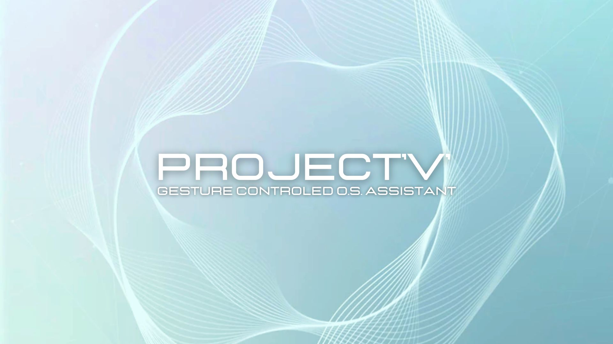
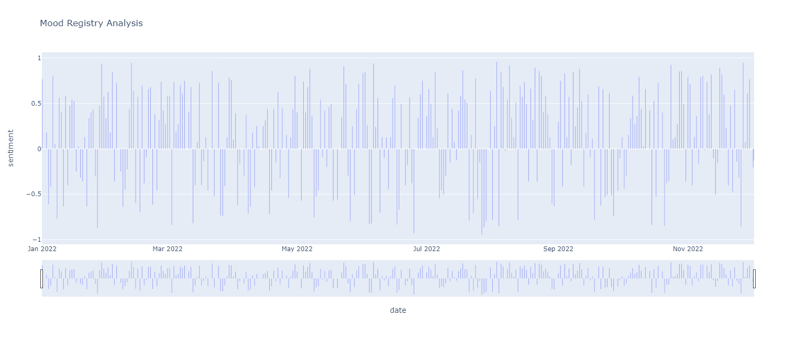
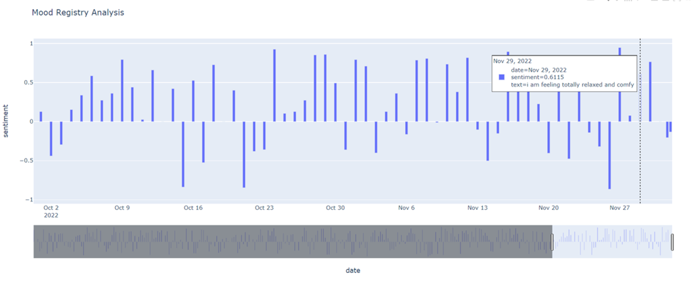

# PROJECT'V'
## Gesture Controled O.S. Assistant

## About  

PROJECT'V' is an interface designed to make everyday life easier by opening the user's most used porgrams/websites quickly with a facial and gesture recognition system. On top of that, it has a built in voice detection and recording function (gesture controled) that records the user's speech, analyses its sentiment, replies accordingly, and stores the mood variables in an SQL database. The records and analysis of the user's mood over time can also be accessed through a hand gesture, making PROJECT'V' a good a Journaling and mood tracker tool. 

 

## Gesture Dictinary  

**Fig1.** Hand gestures recognized by PROJECT'V'

**Disclaimer:** *This hand gestures were not taken from any Sign Language signs and any similarity between the previous and the latter is pure coincidence. These gestures were chosen for my own convenience due to their resemblance with the first letter of each word or mental association.* 

 

## Mood Analysis  
As mentioned above, the "Write" command activates a voice detection function and records the user's mood. Then, PROJECT'V' calculates the overall sentiment of the sentence using NLP, and asks the user to evaluate their mood on a scale from 0 to 10. After the user's input, the current date and time (Y-M-D h:min), user's sentence, mood scale and sentiment score are loaded automatically to SQL. 
By doing the "Records" gesture, PROJECT'V' opens a plot with all the entries the user has registered where they can see the sentiment score and the sentence they recorded. PROJECT'V' also tells the user the average of their mood (out of 10) for the current month and for all the entries they have logged on the database.

**Fig2.** - Sentiment Analysis plot of user's mood over time (1 year)

**Fig3.** - Example of dummy mood entry (29th November 2022)
 

## Practical Applications  
- Employee login or access
- Parental control
- Security and Privacy
- Time-saving/quick access
- Journaling
- Psychology/Psiquiatric patients
- Work Tracker/Manager
- Lab diary
- ...